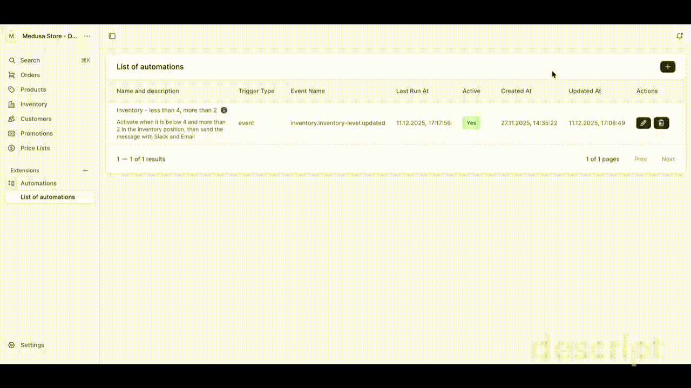

# Medusa plugin automations

A comprehensive automation plugin for Medusa v2 that provides a flexible rule-based automation system with triggers, conditions, and actions. Create automated workflows that can send notifications (email, Slack), execute custom actions, or trigger other processes based on events, schedules, or manual triggers with customizable rules.

## Features

- **Automation Triggers**: Create automations triggered by events, schedules, or manual actions
- **Automation Management**: Create, edit, and delete automation triggers with automatic cleanup of related data
- **Rule-Based Conditions**: Define complex conditions using rule attributes (e.g., inventory levels, order status)
- **Multiple Action Types**: Execute various actions including email notifications, Slack messages, SMS, push notifications, and custom actions
- **Event Subscribers**: Built-in subscribers for common Medusa events (inventory updates, order events, payment events)
- **Admin Panel**: Manage automations directly from Medusa Admin
- **Flexible Rules**: Support for multiple rule types and operators (equals, greater than, less than, contains, etc.)
- **Slack Notifications**: Rich Slack notifications with Block Kit support including headers, action buttons, and dividers
- **Extensible Actions**: Add custom action handlers to extend automation capabilities
- **Type-Safe**: Full TypeScript support with exported types and workflows

## Compatibility

- **Medusa Version**: `>= 2.8.8`
- **Node Version**: `>= 20`

## Installation

```bash
npm install @codee-sh/medusa-plugin-automations
# or
yarn add @codee-sh/medusa-plugin-automations
```

## Quick Start

### 1. Register the Plugin

Add to your `medusa-config.ts`:

```typescript
module.exports = defineConfig({
  plugins: [
    "@codee-sh/medusa-plugin-automations"
  ]
})
```

### 2. Run Migrations

The plugin includes database migrations for automation models. Run migrations to set up the required tables:

```bash
medusa migrations run
```

### 3. Access Admin Panel

Navigate to **Notifications > Automations** in your Medusa Admin dashboard, or directly access:

```
/app/notifications/automations
```

## How It Works

### Automation Triggers

Automations are triggered by:
- **Events**: Medusa events (e.g., `inventory.inventory-level.updated`, `order.placed`)
- **Schedule**: Time-based triggers with configurable intervals (In progress)
- **Manual**: Triggered manually from the admin panel

### Rules and Conditions

Each automation can have multiple rules that define when actions should be executed:

- **Rule Attributes**: Available attributes for conditions
- **Operators**: Comparison operators (equals, greater than, less than, contains, in, etc.)
- **Rule Values**: Values to compare against

### Actions

When automation rules pass, actions are executed. Supported action types include:

- **Email**: Send email notifications
- **Slack**: Send Slack messages with Block Kit formatting
- **Custom**: Extend with custom action handlers

See [Configuration Documentation](./docs/configuration.md) for details on built-in subscribers, available actions, and extending functionality.

## Admin Panel

Access the automations management interface in Medusa Admin at `/app/notifications/automations`. See [Admin Panel Documentation](./docs/admin.md) for details.

## Documentation

- [Configuration](./docs/configuration.md) - Plugin configuration options and extending functionality
- [Admin Panel](./docs/admin.md) - Admin interface usage and automation management

## Exports

The plugin exports the following:

- `@codee-sh/medusa-plugin-automations/workflows` - Workflow functions for automation management
- `@codee-sh/medusa-plugin-automations/modules/mpn-automation` - Automation module service
- `@codee-sh/medusa-plugin-automations/utils` - Utility functions

## Screenshots

### How to edit trigger?


*Automations management interface in Medusa Admin*

## Related Plugins

For email templates and rendering functionality, see [@codee-sh/medusa-plugin-automations-emails](https://github.com/codee-sh/medusa-plugin-notification-emails).

## License

MIT

## Author

Codee Team - [https://codee.dev](https://codee.dev)
