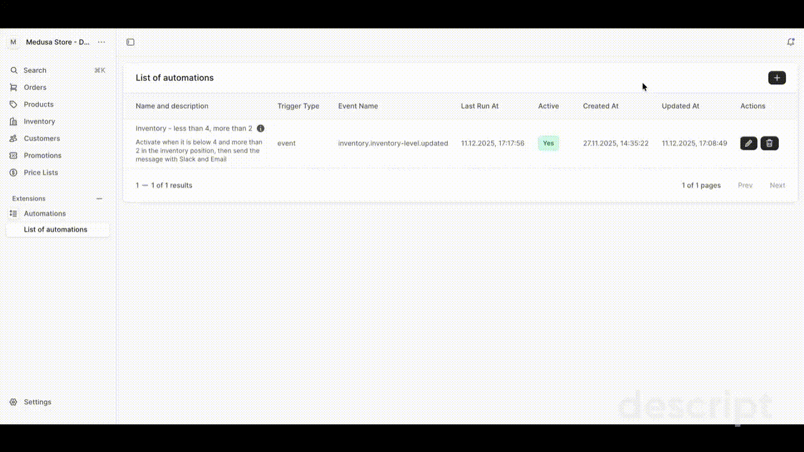

# Medusa plugin automations

A comprehensive automation plugin for Medusa v2 that provides a flexible rule-based automation system with triggers, conditions, and actions. Create automated workflows that can send notifications (email, Slack), execute custom actions, or trigger other processes based on events, schedules, or manual triggers with customizable rules.

## Features

- **Automation Triggers**: Create automations triggered by events, schedules, or manual actions ([see details](#automation-triggers))
- **Rule-Based Conditions**: Define complex conditions with support for arrays, relations, and multiple data types ([see details](#rules-and-conditions))
- **Rich Attribute Support**: Pre-configured attributes for Products, Variants, Tags, Categories, and Inventory ([see available attributes](./docs/configuration.md#available-attributes-reference))
- **Multiple Action Types**: Execute various actions including email notifications, Slack messages, SMS, push notifications, and custom actions ([see details](#actions))
- **Event Subscribers**: Built-in subscribers for common Medusa events ([see available events](./docs/configuration.md#available-subscribers))
- **Admin Panel**: Manage automations directly from Medusa Admin ([see details](#admin-panel))
- **Extensible**: Add custom action handlers and extend automation capabilities
- **Type-Safe**: Full TypeScript support with exported types and workflows

## Compatibility

- **Medusa Version**: `>= 2.8.8`
- **Node Version**: `>= 20`

## Installation

```bash
npm install @codee-sh/medusa-plugin-automations
# or
yarn add @codee-sh/medusa-plugin-automations
```

## Quick Start

### 1. Register the Plugin

Add to your `medusa-config.ts`:

```typescript
module.exports = defineConfig({
  plugins: [
    "@codee-sh/medusa-plugin-automations"
  ]
})
```

### 2. Run Migrations

The plugin includes database migrations for automation models. Run migrations to set up the required tables:

```bash
medusa migrations run
```

See [Database Migrations](./docs/configuration.md#database-migrations) for more details about the created tables.

### 3. Access Admin Panel

Navigate to **Notifications > Automations** in your Medusa Admin dashboard, or directly access:

```
/app/notifications/automations
```

## How It Works

### Automation Triggers

Automations are triggered by:
- **Events**: Medusa events (e.g., `inventory.inventory-level.updated`, `product.updated`)
- **Schedule**: Time-based triggers with configurable intervals (In progress)
- **Manual**: Triggered manually from the admin panel

See [Available Subscribers](./docs/configuration.md#available-subscribers) in the configuration documentation for a complete list of supported events.

### Rules and Conditions

Each automation can have multiple rules that define when actions should be executed. Rules support primitive fields, relations (arrays), nested objects, and various operators for complex conditions.

For detailed information, see:
- [Available Attributes Reference](./docs/configuration.md#available-attributes-reference) - Complete list of attributes for each event type
- [Rule Operators](./docs/configuration.md#rule-operators) - All supported operators with examples
- [Rule Values](./docs/configuration.md#rule-values) - Supported data types and usage

### Actions

When automation rules pass, actions are executed. Supported action types include:

- **Email**: Send email notifications
- **Slack**: Send Slack messages with Block Kit formatting
- **Custom**: Extend with custom action handlers

See [Actions](./docs/configuration.md#actions) and [Slack Notification Provider](./docs/configuration.md#slack-notification-provider) in the configuration documentation for details on configuring and extending actions.

## Admin Panel

Access the automations management interface in Medusa Admin at `/app/notifications/automations`. See [Admin Panel Documentation](./docs/admin.md) for details.

## Documentation

- [Configuration](./docs/configuration.md) - Plugin configuration options and extending functionality
- [Admin Panel](./docs/admin.md) - Admin interface usage and automation management

## Exports

The plugin exports the following:

- `@codee-sh/medusa-plugin-automations/workflows` - Workflow functions for automation management
- `@codee-sh/medusa-plugin-automations/modules/mpn-automation` - Automation module service
- `@codee-sh/medusa-plugin-automations/utils` - Utility functions

## Screenshots

### How to edit trigger?


*Automations management interface in Medusa Admin*

## Related Plugins

For email templates and rendering functionality, see [@codee-sh/medusa-plugin-automations-emails](https://github.com/codee-sh/medusa-plugin-notification-emails).

## License

MIT

## Author

Codee Team - [https://codee.dev](https://codee.dev)
